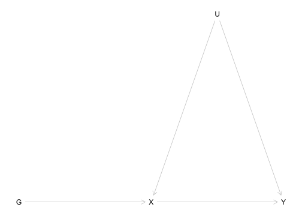
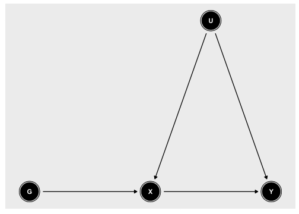
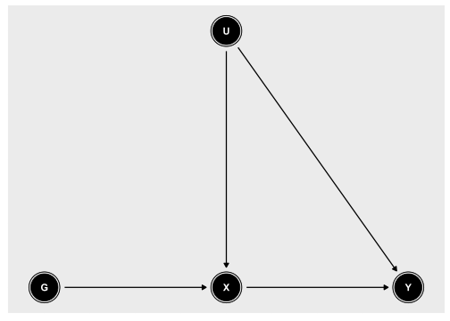
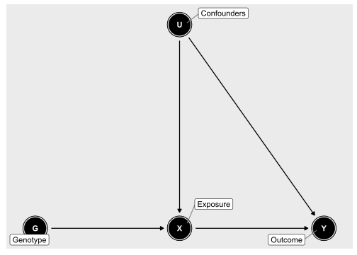
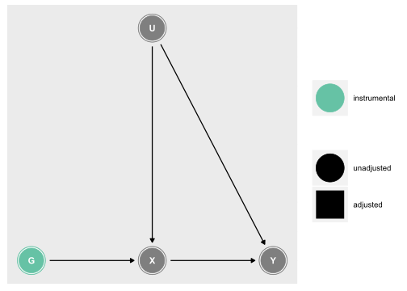
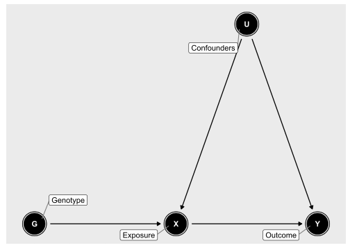
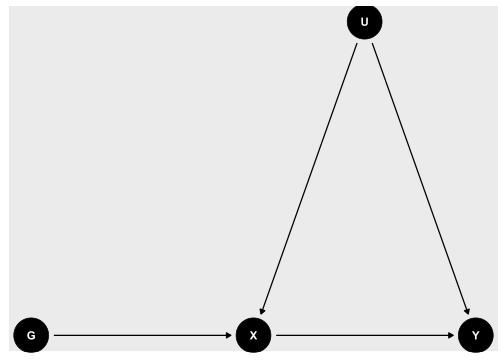
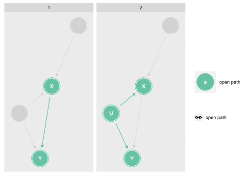
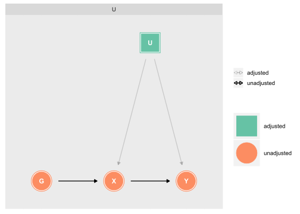
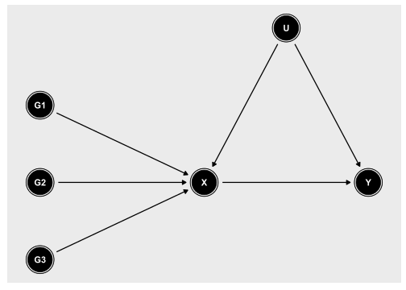

Code to plot DAGs for Mendelian randomization analyses
================
Tom Palmer
2019-01-24

This webpage shows the code for generating figures for Mendelian
randomization analyses.

First we load in the tidyverse collection of packages to have access to
the pipe and the ggplot2 package, amongst other features.

``` r
library(tidyverse)
```

# DiagrammeR package

The website for DiagrammeR is here:
<http://rich-iannone.github.io/DiagrammeR/> .

``` r
library(DiagrammeR)
```

## Single genotype

``` r
grViz("
      digraph mrdag {

      graph [rankdir=TB]

      node [shape=ellipse]
      U [label='Confounders']

      node [shape=box]
      G [label='Genotype']
      X [label='Phenotype']
      Y [label='Outcome']

      { rank = same; G X Y }

      G -> X [minlen=3]
      U -> X
      U -> Y
      X -> Y [minlen=3]
      }
      ")
```

## Multiple genotypes

``` r
grViz("
      digraph mrdag {

      graph [rankdir=LR]

      node [shape=ellipse]
      U [label='Confounders']

      node [shape=box]
      G1 [label='Genotype 1']
      G2 [label='Genotype 2']
      G3 [label='Genotype 3']
      X [label='Phenotype']
      Y [label='Outcome']

      { rank = same; G1 G2 G3 }

      G1 -> X 
      G2 -> X 
      G3 -> X 
      U -> X
      U -> Y
      X -> Y
      }
      ")
```

# dagitty package

The website for DAGitty is here <http://www.dagitty.net/> .

``` r
library(dagitty)
```

## Using dot syntax

``` r
mrdag <- dagitty('dag {
  G -> X -> Y
  X <- U -> Y
  G [pos="0,0"]
  X [e, pos="1,0"]
  U [pos="1.5,-1"]
  Y [o, pos="2,0"]
}')

plot(mrdag)
```

<!-- -->

## Version using ggdag

``` r
library(ggdag)
```

    ## 
    ## Attaching package: 'ggdag'

    ## The following object is masked from 'package:ggplot2':
    ## 
    ##     expand_scale

    ## The following object is masked from 'package:stats':
    ## 
    ##     filter

``` r
mrdag <- dagitty('dag {
  G -> X -> Y
  X <- U -> Y
  G [pos="0,0"]
  X [e, pos="1,0"]
  U [pos="1.5,1"]
  Y [o, pos="2,0"]
}')

ggmrdag <- tidy_dagitty(mrdag)
ggdag(ggmrdag)
```

<!-- -->

Alternatively we could position \(U\) over \(X\).

``` r
mrdag <- dagitty('dag {
  G -> X -> Y
  X <- U -> Y
  G [pos="0,0"]
  X [e, pos="1,0"]
  U [pos="1,1"]
  Y [o, pos="2,0"]
}')

ggmrdag <- tidy_dagitty(mrdag)
ggdag(ggmrdag)
```

<!-- -->

This can be labelled as follows.

``` r
mrdag <- mrdag %>% 
  dag_label(
    labels = c(
      "X" = "Exposure", 
      "Y" = "Outcome", 
      "G" = "Genotype",
      "U" = "Confounders"))
ggdag(mrdag,  use_labels = "label")
```

<!-- -->

Dagitty can identify the instrumental variable on the DAG.

``` r
mrdag %>% ggdag_instrumental()
```

<!-- -->

## Using ggdag dagify R model type syntax

``` r
coords <- list(x = c(
  G = 0,
  X = 1,
  Y = 2,
  U = 1.5
),
y = c(
  G = 0,
  X = 0,
  Y = 0,
  U = 1
))

mrdag <- dagify(
  X ~ G + U,
  Y ~ X + U,
  labels = c(
    "G" = "Genotype",
    "X" = "Exposure",
    "Y" = "Outcome",
    "U" = "Confounders"
  ),
  exposure = "X",
  outcome = "Y",
  coords = coords
)

ggdag(mrdag, use_labels = "label")
```

<!-- -->

Plotting directly with ggplot2 functions.

``` r
mrdag %>%
  ggplot(aes(
    x = x,
    y = y,
    xend = xend,
    yend = yend
  )) +
  geom_dag_point() +
  geom_dag_edges() +
  geom_dag_text() +
  theme_dag()
```

<!-- -->

Showing the paths.

``` r
dagify(Y ~ X + U,
       X ~ U + G,
       exposure = "X",
       outcome = "Y") %>%
ggdag_paths()
```

<!-- -->

Adjustment set for the effect of \(X\) on \(Y\).

``` r
dagify(Y ~ X + U,
       X ~ U + G,
       exposure = "X",
       outcome = "Y", 
       coords = coords) %>%
  ggdag_adjustment_set()
```

<!-- -->

## Multiple genotypes

``` r
coords2 <- list(x = c(
  G1 = 0,
  G2 = 0,
  G3 = 0,
  X = 1,
  Y = 2,
  U = 1.5
),
y = c(
  G1 = 0.5,
  G2 = 0,
  G3 = -0.5,
  X = 0,
  Y = 0,
  U = 1
))


mrdag <- dagify(
  X ~ G1,
  X ~ G2,
  X ~ G3,
  Y ~ X,
  X ~ U,
  Y ~ U,
  exposure = "X",
  outcome = "Y",
  coords = coords2
)

ggdag(mrdag)
```

<!-- -->
